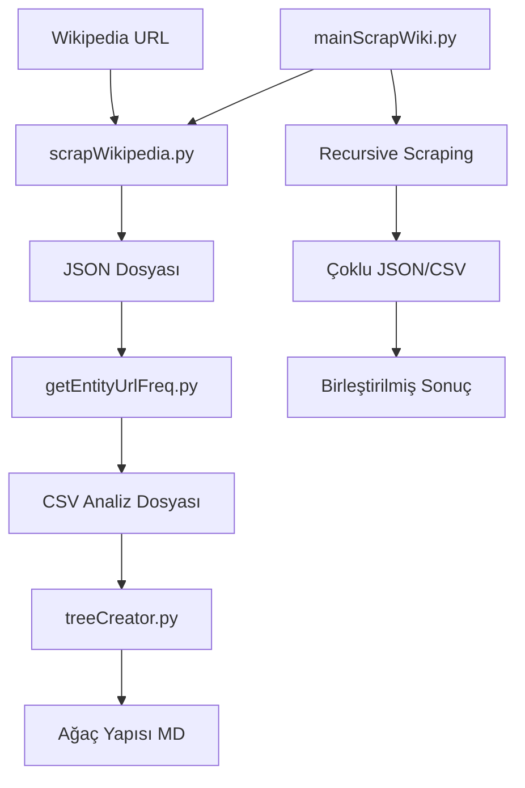

# Wikipedia Data Collection & Entity Analysis Project

## 📋 Proje Özeti
Bu proje, Wikipedia sayfalarından veri toplama, entity çıkarma ve frekans analizi yapma amacıyla geliştirilmiş bir Python uygulamasıdır. Proje, belirli bir Wikipedia sayfasından başlayarak belirtilen derinliğe kadar recursive scraping yapar ve entity-URL ilişkilerini analiz eder.

## 🎯 Proje Hedefleri
- Wikipedia sayfalarından yapılandırılmış veri çıkarma
- Entity-URL ilişkilerinin frekans analizi
- Çok seviyeli ağaç yapısı oluşturma
- Recursive web scraping ile derin veri toplama

## 📁 Dosya Yapısı

```
DataCollection/
├── mainScrapWiki.py          # Ana uygulama - recursive scraping
├── scrapWikipedia.py         # Wikipedia scraper modülü
├── getEntityUrlFreq.py       # Entity-URL frekans analiz modülü
├── treeCreator.py            # Ağaç yapısı oluşturucu
├── process.md                # Bu dosya - proje dokümantasyonu
└── __pycache__/              # Python cache dosyaları
```

## 🔧 Modül Detayları

### 1. mainScrapWiki.py
**Ana uygulama modülü**
- Kullanıcıdan root URL ve maksimum derinlik alır
- Belirtilen derinliğe kadar recursive scraping yapar
- Her sayfa için JSON ve CSV çıktıları üretir
- Tüm sonuçları tek bir CSV'de birleştirir

**Özellikler:**
- Derinlik bazlı scraping kontrolü
- Ziyaret edilen sayfaları takip eder
- Rate limiting (bekleme süresi)
- Sonuçları otomatik birleştirme

### 2. scrapWikipedia.py
**Wikipedia scraper engine**
- Wikipedia sayfalarından HTML içerik çeker
- Infobox (vcard) verilerini çıkarır
- Ana içeriği cümle bazında parçalar
- Entity-URL formatında link bilgilerini korur

**Özellikler:**
- Gelişmiş cümle ayırma algoritması
- Entity koruma sistemi (`___E:... U:(...)___`)
- UTF-8 karakter desteği
- Robust error handling

### 3. getEntityUrlFreq.py
**Entity frekans analiz modülü**
- JSON dosyalarından entity-URL çiftlerini çıkarır
- Frekans hesaplamları yapar
- Kaynak ID'leri takip eder
- CSV formatında raporlama

**Çıktı formatı:**
- E: Entity adı
- U: URL adresi
- Frekans: Kaç kez geçtiği
- Kaynak_IDler: Hangi cümlelerde bulunduğu

### 4. treeCreator.py
**Ağaç yapısı oluşturucu**
- CSV verilerinden parent-child ilişkileri çıkarır
- Çok seviyeli ağaç yapısı oluşturur
- Frekans bazlı sıralama yapar
- Markdown formatında çıktı üretir

## 🚀 Kullanım Senaryoları

### Senaryo 1: Temel Scraping
```python
python mainScrapWiki.py
# Input: Wikipedia URL ve derinlik
# Output: JSON ve CSV dosyaları
```

### Senaryo 2: Tek Sayfa Analizi
```python
from scrapWikipedia import veri_cek_ve_json_olarak_dondur
sonuc = veri_cek_ve_json_olarak_dondur("https://tr.wikipedia.org/wiki/...")
```

### Senaryo 3: Entity Analizi
```python
from getEntityUrlFreq import analiz_yap
df = analiz_yap("WikiOutput.json", "analiz_sonucu.csv")
```

### Senaryo 4: Ağaç Yapısı Oluşturma
```python
python treeCreator.py analiz_sonucu.csv
```

## 📊 Veri Akışı



## 🛠️ Teknik Özellikler

### Kullanılan Kütüphaneler
- `requests` - HTTP istekleri
- `beautifulsoup4` - HTML parsing
- `pandas` - Veri analizi ve manipülasyon
- `json` - JSON işlemleri
- `re` - Regex işlemleri
- `urllib.parse` - URL işlemleri

### Veri Formatları
- **Input**: Wikipedia URL'leri
- **Intermediate**: JSON (Card + Main yapısı)
- **Output**: CSV (Entity-URL frekans tablosu)
- **Visualization**: Markdown ağaç yapısı

### Performance Özellikleri
- Rate limiting ile server koruması
- Memory efficient processing
- Incremental file output
- Duplicate URL kontrolü

## 🎛️ Konfigürasyon

### mainScrapWiki.py Ayarları
```python
max_depth = 2          # Maksimum scraping derinliği
bekleme_suresi = 1     # Sayfalar arası bekleme süresi (saniye)
BASE_URL = "https://tr.wikipedia.org"  # Türkçe Wikipedia
```

### scrapWikipedia.py Ayarları
```python
timeout = 10           # HTTP timeout süresi
User-Agent header      # Bot detection önleme
```

## 📈 Çıktı Örnekleri

### JSON Yapısı
```json
{
    "Title": "Sayfa Başlığı",
    "Card": {
        "Alan1": "Değer1 ___E:Entity U:(URL)___",
        "Alan2": "Değer2"
    },
    "Main": [
        {
            "id": "SayfaAdı#1",
            "sentence": "Cümle ___E:Entity U:(URL)___ devamı"
        }
    ]
}
```

### CSV Çıktısı
```csv
E,U,Frekans,Kaynak_IDler
Türkiye,https://tr.wikipedia.org/wiki/Türkiye,5,Sayfa#1=Sayfa#3
Ankara,https://tr.wikipedia.org/wiki/Ankara,3,Sayfa#2
```

## 🔍 Kalite Kontrol

### Error Handling
- Network timeout kontrolü
- Invalid URL kontrolü
- Empty content kontrolü
- Encoding error kontrolü

### Data Validation
- JSON format kontrolü
- Entity format validation
- URL format validation
- Frequency calculation verification

## 🚦 Çalışma Adımları

1. **Kurulum**
   ```bash
   pip install requests beautifulsoup4 pandas
   ```

2. **Ana Uygulama Çalıştırma**
   ```bash
   python mainScrapWiki.py
   ```

3. **Sonuç Analizi**
   - `E_U_Toplam.csv` dosyasını inceleyin
   - En sık geçen entity'leri görüntüleyin

4. **Ağaç Yapısı Oluşturma**
   ```bash
   python treeCreator.py E_U_Toplam.csv
   ```
