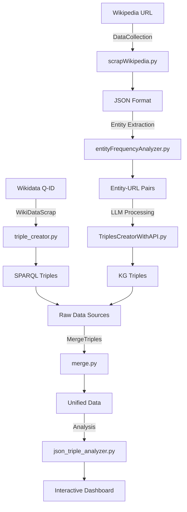

# SDP (Semantic Data Processing) Projesi - Kapsamlı Dokümantasyon

## 📋 Proje Genel Özeti

Bu proje, **Wikipedia** ve **Wikidata** kaynaklarından semantik bilgi çıkarma, **Knowledge Graph** (Bilgi Grafiği) oluşturma ve **analiz** işlemlerini gerçekleştiren kapsamlı bir Python uygulamasıdır. Proje, veri toplama, işleme, birleştirme ve görselleştirme aşamalarını içeren tam bir **semantic data processing** pipeline'ı sağlar.

---

## 🎯 Ana Hedefler

1. **Veri Toplama**: Wikipedia sayfalarından yapılandırılmış veri çıkarma
2. **Entity Çıkarımı**: Metinlerden entity-URL ilişkilerini belirleme  
3. **Knowledge Graph Oluşturma**: LLM ile semantik üçlü (triple) üretme
4. **Veri Birleştirme**: Farklı kaynaklardan gelen verileri merge etme
5. **Analiz ve Görselleştirme**: İnteraktif analiz araçları ile sonuçları değerlendirme

---

## 🏗️ Proje Mimarisi - File Tree

```
📁 SDP/
│
├── 📄 json_triple_analyzer.py          # İnteraktif JSON KG Triple analiz aracı (Streamlit)
├── 📄 knowledge_graph_extractor.py     # Standalone KG çıkarma aracı (LLM API)
├── 📄 loyaut.md                        # Bu dokümantasyon dosyası
│
├── 📁 DataCollection/                   # Veri Toplama Ana Modülü
│   ├── 📄 mainScrapWiki.py             # 🎯 ANA: Recursive Wikipedia scraping
│   ├── 📄 scrapWikipedia.py            # Wikipedia scraper engine
│   ├── 📄 entityFrequencyAnalyzer.py   # Entity frekans analiz motoru
│   ├── 📄 getEntityUrlFreq.py          # Entity-URL frekans çıkarıcı
│   ├── 📄 process.md                   # DataCollection modülü dokümantasyonu
│   ├── 📄 sysprompt.json               # LLM sistem promptları
│   ├── 📄 syspromptforWikiDATA.json    # WikiData özelleştirme promptları
│   │
│   ├── 📁 CreateTriplesByLLM/          # LLM ile Triple Üretimi
│   │   ├── 📄 TriplesCreatorWithAPI.py # 🔥 LLM API ile Knowledge Graph çıkarma
│   │   └── 📄 .env                     # API key konfigürasyonu
│   │
│   ├── 📁 data/                        # Örnek veri dosyaları
│   │   ├── 📄 de_bruyne_knowledge_graph.json
│   │   ├── 📄 de_bruyne.csv
│   │   ├── 📄 maradona.csv
│   │   ├── 📄 messi.csv
│   │   ├── 📄 ronaldo.csv
│   │   └── 📄 yamal.csv
│   │
│   └── 📁 field_compare/               # Alan karşılaştırma araçları
│       ├── 📄 entity_set_analysis.py  # Entity set analizi
│       └── 📄 interactive.py           # İnteraktif karşılaştırma
│
├── 📁 WikiDataScrap/                   # Wikidata Veri Çıkarma Modülü
│   ├── 📄 triple_creator.py            # 🎯 ANA: Wikidata triple çıkarıcı (SPARQL)
│   ├── 📄 api_scrap.py                 # Wikidata API scraper (İngilizce)
│   ├── 📄 api_scrap_turkish.py         # Wikidata API scraper (Türkçe)
│   ├── 📄 create_KG.py                 # Knowledge Graph görselleştirici
│   ├── 📄 query.py                     # Wikidata SPARQL sorgu motoru
│   ├── 📄 README.md                    # WikiDataScrap modülü dokümantasyonu
│   │
│   ├── 📁 json_outputs/                # Triple çıktı dosyaları
│   │   ├── 📄 Q113704154_triples.json
│   │   ├── 📄 Q11571_triples.json
│   │   ├── 📄 Q17515_triples.json
│   │   ├── 📄 Q357984_triples.json
│   │   └── 📄 Q615_triples.json
│   │
│   ├── 📁 detailed_info_turkish/       # Detaylı Türkçe entity bilgileri
│   │   └── 📄 Q615.json
│   │
│   └── 📁 related_entities/            # İlişkili entity listeleri
│       ├── 📄 Q615.txt
│       └── 📄 Q715.txt
│
├── 📁 MergeTriples/                    # Veri Birleştirme Modülü
│   ├── 📄 merge.py                     # 🎯 ANA: Kapsamlı merge işlemi (3-in-1)
│   ├── 📄 mergeEntitiyType.py          # Entity tiplerini birleştirici
│   ├── 📄 mergeJsonsByRelatiın.py      # İlişki bazlı birleştirici
│   └── 📄 mergeJsonsByRelationAndTypes.py # İlişki+tip bazlı birleştirici
│
└── 📁 Wikipedia_Wikidata_compare/      # Karşılaştırma ve Analiz Modülü
    ├── 📄 info.md                      # Karşılaştırma bilgileri
    ├── 📄 LLMWithCasualDataExample.json # LLM ile çıkarılan örnek veri
    ├── 📄 LLMwithWikiDataExample.json   # LLM+WikiData hibrit veri
    ├── 📄 WikiDataTriples.json          # Saf WikiData triple'ları
    │
    └── 📁 mergedformOfAboveTriples/     # Birleştirilmiş final veriler
        ├── 📄 entity_types_merged.json
        ├── 📄 relations_merged.json
        ├── 📄 relations_and_types_merged.json
        └── 📄 statistics.json
```

---

## 🔄 İş Akışı ve Modül İlişkileri

### 📊 Hierarchical İş Akışı



---

## 📖 Detaylı Modül Açıklamaları

### 🎯 1. DataCollection Modülü

**Ana Sorumluluğu**: Wikipedia'dan yapılandırılmış veri toplama ve entity çıkarımı

#### 🔥 Ana Dosyalar:

##### `mainScrapWiki.py` 
- **Görevi**: Recursive Wikipedia scraping motoru
- **Özellikler**:
  - Belirtilen derinliğe kadar otomatik sayfa tarama
  - Rate limiting ile server koruması  
  - Ziyaret edilen sayfaları takip eder
  - Kümülatif entity frekans analizi
- **Çıktı**: JSON dosyaları + CSV frekans tabloları
- **Kullanım**: `python mainScrapWiki.py` → Root URL ve depth girişi

##### `scrapWikipedia.py`
- **Görevi**: Wikipedia HTML parsing ve yapılandırma
- **Özellikler**:
  - Infobox (vcard) verilerini çıkarır
  - Entity-URL formatında link koruması (`<PossibleEntity>...</PossibleEntity>`)
  - Gelişmiş cümle ayırma algoritması
  - UTF-8 karakter desteği
- **Çıktı Formatı**:
```json
{
  "Title": "Sayfa Başlığı",
  "Card": { "Alan1": "Değer <PossibleEntity>Entity</PossibleEntity> <URL>:(URL)</URL>" },
  "Main": [
    { "id": "Sayfa#1", "sentence": "Cümle içeriği..." }
  ]
}
```

##### `entityFrequencyAnalyzer.py`
- **Görevi**: Entity frekans analizi ve cross-page tracking
- **Özellikler**:
  - Sayfa bazlı entity sayımı
  - Duplicate detection
  - Global entity frequency tracking
  - Entity-URL çifti analizi
- **Çıktı**: CSV frekans tabloları

##### `CreateTriplesByLLM/TriplesCreatorWithAPI.py`
- **Görevi**: LLM API ile Knowledge Graph triple üretimi
- **Özellikler**:
  - OpenRouter API entegrasyonu
  - CSV batch processing
  - Otomatik frekans değeri okuma
  - Rate limiting ve error handling
- **Çıktı Formatı**:
```json
[
  {
    "metin": "Kaynak cümle",
    "baş": "Varlık adı",
    "baş_tipi": "Varlık tipi", 
    "ilişki": "İlişki türü",
    "uç": "Hedef varlık",
    "uç_tipi": "Hedef varlık tipi"
  }
]
```

---

### 🎯 2. WikiDataScrap Modülü

**Ana Sorumluluğu**: Wikidata'dan structured data çıkarma

#### 🔥 Ana Dosyalar:

##### `triple_creator.py` (Önerilen Ana Araç)
- **Görevi**: Wikidata SPARQL ile triple çıkarma
- **Özellikler**:
  - Tek Q-ID ile tam relationship mapping
  - Türkçe label desteği (fallback: İngilizce)
  - Otomatik tip çıkarımı (P31 properties)
  - JSON çıktı formatı
- **Kullanım**: `python triple_creator.py` → Q-ID girişi
- **Çıktı**: `json_outputs/Q{ID}_triples.json`

##### `api_scrap_turkish.py` & `api_scrap.py`
- **Görevi**: Wikidata MediaWiki API ile batch data çekme  
- **Özellikler**:
  - 50'li batch processing
  - Rate limiting
  - Türkçe/İngilizce dil desteği
- **Kullanım**: İlişkili entity listesi → Detaylı bilgi JSON

##### `create_KG.py`
- **Görevi**: Knowledge Graph görselleştirme
- **Özellikler**:
  - NetworkX ile graf oluşturma
  - Matplotlib görselleştirme
  - Gephi format export

---

### 🎯 3. MergeTriples Modülü

**Ana Sorumluluğu**: Farklı kaynaklardan gelen verileri birleştirme

#### 🔥 Ana Dosya:

##### `merge.py` (3-in-1 Comprehensive Merger)
- **Görevi**: Tüm merge operasyonlarını gerçekleştirir
- **İşlevler**:
  1. **Entity Types Merge**: Varlık tiplerini birleştirir
  2. **Relations Merge**: İlişkileri birleştirir  
  3. **Relations+Types Merge**: Hem ilişki hem tip birleştirme
- **Girdi**: 3 JSON dosyası (LLMWithCasualDataExample, LLMwithWikiDataExample, WikiDataTriples)
- **Çıktı**: `mergedformOfAboveTriples/` klasörü
  - `entity_types_merged.json`
  - `relations_merged.json` 
  - `relations_and_types_merged.json`
  - `statistics.json`

---

### 🎯 4. Wikipedia_Wikidata_compare Modülü

**Ana Sorumluluğu**: Farklı veri kaynaklarını karşılaştırma ve final analiz

#### 📁 İçerik:
- **Örnek Veri Dosyaları**: LLM, WikiData ve hibrit örnekler
- **Merged Data**: Final birleştirilmiş veriler
- **İstatistikler**: Veri kalitesi ve coverage analizi

---

### 🎯 5. Ana Seviye Analiz Araçları

#### `json_triple_analyzer.py` (Streamlit Dashboard)
- **Görevi**: İnteraktif JSON KG analiz dashboard'u
- **Özellikler**:
  - 📊 Dosya bilgileri ve istatistikler
  - 🔗 Kesişim analizi (tam eşleşme)
  - 🔥 İnteraktif heatmap görselleştirme
  - 🔍 Detaylı triple analizi ve filtreleme
  - 🔗 Benzer varlık analizi (fuzzy matching)
  - 🔄 Merged data kalite analizi
  - 📈 Coverage ve information loss analizi
  - 🎯 İnteraktif graf ağı görselleştirme
- **Çalışma**: `streamlit run json_triple_analyzer.py`

#### `knowledge_graph_extractor.py` 
- **Görevi**: Standalone KG çıkarma aracı
- **Özellikler**:
  - OpenRouter API desteği
  - İnteraktif metin analizi
  - Configurable model selection
  - Sonuç kaydetme ve analiz

---

## 🚀 Kullanım Senaryoları

### 📋 Senaryo 1: Wikipedia'dan Comprehensive Data Mining

```bash
# 1. Wikipedia recursive scraping
cd DataCollection
python mainScrapWiki.py
# Input: https://tr.wikipedia.org/wiki/Lionel_Messi, depth=2

# 2. LLM ile Knowledge Graph çıkarma  
cd CreateTriplesByLLM
python TriplesCreatorWithAPI.py
# Input: CSV file path from step 1

# 3. Sonuçları analiz
cd ../..
streamlit run json_triple_analyzer.py
```

### 📋 Senaryo 2: Wikidata Structured Extraction

```bash
# 1. Wikidata triple çıkarma
cd WikiDataScrap  
python triple_creator.py
# Input: Q125582 (Lionel Messi)

# 2. Sonuçları görselleştirme
python create_KG.py

# 3. Karşılaştırmalı analiz
cd ..
streamlit run json_triple_analyzer.py
```

### 📋 Senaryo 3: Multi-Source Data Integration

```bash
# 1. Wikipedia + Wikidata + LLM verilerini toplama
# (Senaryo 1 ve 2'yi takip et)

# 2. Verileri birleştirme
cd MergeTriples
python merge.py
# Input: Wikipedia_Wikidata_compare klasör yolu

# 3. Final analysis
cd ..
streamlit run json_triple_analyzer.py
# "Merged dosyalarını da yükle" seçeneğini işaretle
```

---

## 🛠️ Teknik Özellikler

### 📚 Ana Kütüphaneler
```python
# Web scraping ve veri işleme
requests, beautifulsoup4, pandas, json, re

# LLM API entegrasyonu  
openai, anthropic (via OpenRouter)

# Visualizasyon ve analiz
streamlit, plotly, networkx, matplotlib

# Utility
rapidfuzz, collections, pathlib, os
```

### 🔧 Konfigürasyon Dosyaları

#### `.env` (CreateTriplesByLLM klasöründe)
```bash
openrouter_api_key=your_api_key_here
```

#### `syspromptforWikiDATA.json`
- LLM için Türkçe Knowledge Graph çıkarma promptları
- Örnek output formatları
- Entity ve relation type tanımları

---

## 📊 Veri Formatları ve Standartları

### 🎯 Wikipedia Scraping Output (JSON)
```json
{
  "Title": "Lionel Messi",
  "Card": {
    "Doğum tarihi": "24 Haziran 1987 <PossibleEntity>Argentina</PossibleEntity> <URL>:(https://tr.wikipedia.org/wiki/Argentina)</URL>"
  },
  "Main": [
    {
      "id": "Lionel Messi#1", 
      "sentence": "Messi, <PossibleEntity>FC Barcelona</PossibleEntity> <URL>:(https://tr.wikipedia.org/wiki/FC_Barcelona)</URL>'da oynayan futbolcudur."
    }
  ]
}
```

### 🎯 Knowledge Graph Triple Format
```json
[
  {
    "metin": "Kaynak cümle içeriği",
    "baş": "Lionel Messi",
    "baş_tipi": "Futbolcu", 
    "ilişki": "Oynadı",
    "uç": "FC Barcelona",
    "uç_tipi": "Futbol Kulübü"
  }
]
```

### 🎯 Entity Frequency Analysis (CSV)
```csv
E,U,Frekans,Kaynak_IDler
Lionel Messi,https://tr.wikipedia.org/wiki/Lionel_Messi,15,Page1#1 | Page2#3 | Page3#7
FC Barcelona,https://tr.wikipedia.org/wiki/FC_Barcelona,8,Page1#2 | Page2#1
```

### 🎯 Merged Data Statistics
```json
{
  "original_records": 450,
  "unique_entities": 89, 
  "merged_relations": 156,
  "merged_relations_with_types": 203,
  "reduction_stats": {
    "entity_types_reduction": "450 -> 89",
    "relations_reduction": "450 -> 156" 
  }
}
```

---

## 📈 Performans ve Kalite Metrikleri

### 🎯 Veri Kalitesi Göstergeleri

#### Coverage Analysis
- **Entity Coverage**: Orijinal varlıkların merge'de korunma oranı
- **Relation Coverage**: İlişkilerin korunma oranı  
- **Triple Coverage**: Üçlülerin korunma oranı

#### Information Quality
- **Duplicate Reduction**: Tekrar eden kayıtların temizleme oranı
- **Entity Normalization**: Benzer varlıkların birleştirme başarısı
- **Consistency Score**: Veri tutarlılığı değerlendirmesi

#### Processing Efficiency  
- **Scraping Rate**: Sayfa/dakika scraping hızı
- **API Rate Limiting**: LLM API kullanım optimizasyonu
- **Memory Usage**: Büyük veri setlerinde bellek verimliliği

---

## 🔧 Kurulum ve Dependency Management

### 📋 Gerekli Python Paketleri
```bash
# Temel web scraping
pip install requests beautifulsoup4 pandas

# LLM ve AI
pip install openai python-dotenv

# Visualization ve analiz 
pip install streamlit plotly networkx matplotlib

# Text processing ve similarity
pip install rapidfuzz

# Graph processing
pip install gephi-toolkit  # İsteğe bağlı
```

### 🎯 Ortam Hazırlığı
```bash
# 1. Repository'yi clone et
git clone [repo-url]
cd SDP

# 2. Virtual environment oluştur
python -m venv venv
source venv/bin/activate  # Linux/Mac
# veya
venv\Scripts\activate     # Windows

# 3. Dependencies yükle
pip install -r requirements.txt

# 4. API key ayarla
cd DataCollection/CreateTriplesByLLM
echo "openrouter_api_key=your_key" > .env

# 5. Test run
cd ../..
python -c "import streamlit; print('Setup OK!')"
```

---

## 🔍 Troubleshooting ve Best Practices

### 🎯 Sık Karşılaşılan Problemler

#### Rate Limiting Issues
- **Problem**: API rate limit aşımı
- **Çözüm**: `time.sleep()` değerlerini artır
- **Kod**: `TriplesCreatorWithAPI.py` içinde bekleme süresi ayarı

#### Memory Issues  
- **Problem**: Büyük veri setlerinde bellek tükenmesi
- **Çözüm**: Batch processing ve incremental save
- **Kod**: `mainScrapWiki.py` içinde chunk size ayarı

#### JSON Parsing Errors
- **Problem**: LLM çıktısında geçersiz JSON
- **Çözüm**: Response cleaning ve validation
- **Kod**: `knowledge_graph_extractor.py` içinde JSON temizleme

### 🎯 Performance Optimization

#### Wikipedia Scraping
```python
# Optimal settings
MAX_DEPTH = 2-3        # Daha yüksek değerler exponential artış
WAIT_TIME = 1-2 sec    # Server yükünü azaltmak için
BATCH_SIZE = 50        # API çağrıları için
```

#### LLM API Usage
```python
# Cost optimization
MODEL = "llama-3.2-3b-instruct:free"  # Free tier kullanım
TEMPERATURE = 0.1-0.3  # Deterministik sonuçlar
MAX_TOKENS = 1500      # Token limit kontrolü
```

---

## 🚀 Gelecek Geliştirmeler ve Roadmap

### 🎯 Kısa Vadeli (v2.0)

#### 🔧 Teknik İyileştirmeler
- **Async Processing**: Paralel Wikipedia scraping
- **Database Integration**: PostgreSQL/MongoDB desteği
- **API Gateway**: Rate limiting ve caching
- **Error Recovery**: Automatic retry mechanisms

#### 📊 Analiz Geliştirmeleri
- **Advanced NLP**: spaCy/NLTK entegrasyonu  
- **Graph Algorithms**: Centrality ve community detection
- **ML Classification**: Entity type prediction
- **Semantic Search**: Embedding-based similarity

### 🎯 Orta Vadeli (v3.0)

#### 🌐 Platform Genişletmesi
- **Multi-language Support**: İngilizce, Almanca, Fransızca
- **Real-time Processing**: Streaming data pipeline
- **Web Interface**: Full-stack web application
- **API Endpoints**: RESTful service architecture

#### 🔬 Advanced Analytics
- **Temporal Analysis**: Time-series knowledge evolution
- **Cross-domain Linking**: Multi-domain entity resolution  
- **Quality Scoring**: Automated data quality assessment
- **Anomaly Detection**: Inconsistency flagging

### 🎯 Uzun Vadeli (v4.0+)

#### 🤖 AI/ML Integration
- **Custom LLM Training**: Domain-specific model fine-tuning
- **Active Learning**: Human-in-the-loop improvements
- **Automated Reasoning**: Logic-based inference
- **Multi-modal Processing**: Image, video, audio integration

#### 🏢 Enterprise Features
- **Scalability**: Kubernetes deployment
- **Security**: Authentication ve authorization
- **Monitoring**: Comprehensive logging ve metrics  
- **Integration**: Enterprise system connectors

---

## 📞 Katkı ve Destek

### 🎯 Katkıda Bulunma
- **Issue Reporting**: GitHub Issues kullanın
- **Feature Requests**: Enhancement önerileri
- **Code Contributions**: Pull Request süreçleri
- **Documentation**: Dokümantasyon iyileştirmeleri

### 🎯 Destek Kanalları
- **Technical Issues**: GitHub Discussions
- **Usage Questions**: README ve Wiki
- **Performance Issues**: Profiling raporları
- **Integration Help**: Example implementations

---

## 📜 License ve Yasal Uyarılar

### 🎯 Kullanım Koşulları
- **Wikipedia API**: Uygun rate limiting gerekli
- **Wikidata SPARQL**: Public endpoint kullanım kuralları
- **LLM APIs**: Provider terms of service
- **Data Usage**: Attribution ve fair use

### 🎯 Veri Gizliliği
- **No Personal Data**: Kişisel bilgi işlenmez
- **Public Sources**: Sadece açık kaynak veriler
- **Transparent Processing**: Tüm işlemler izlenebilir
- **User Control**: Veri silme ve değiştirme hakları

---

## 📊 Sonuç ve Özet

Bu **SDP (Semantic Data Processing)** projesi, modern semantic web teknolojilerini kullanarak Wikipedia ve Wikidata'dan kapsamlı bilgi çıkarımı yapan, bu bilgileri yapılandırarak knowledge graph'lar oluşturan ve interactive analiz araçları sunan **end-to-end bir data science pipeline**'ıdır.

### 🎯 Proje Değeri
- **Academic Research**: Bilimsel çalışmalar için structured data
- **Business Intelligence**: Market ve competitor analysis  
- **Educational Tools**: Interactive learning dashboards
- **AI/ML Training**: High-quality training datasets

### 🎯 Teknik Achievements
- **Multi-source Integration**: 3 farklı veri kaynağı birleştirmesi
- **Scalable Architecture**: Modular ve genişletilebilir design
- **Interactive Analysis**: Real-time data exploration
- **Quality Assurance**: Comprehensive validation ve cleaning

Bu dokümantasyon, projenin tüm bileşenlerini, kullanım senaryolarını ve technical detaylarını kapsamlı olarak açıklamaktadır. Herhangi bir modül veya süreç hakkında daha detaylı bilgi için ilgili kod dosyalarını ve modül-specific dokümantasyonları inceleyebilirsiniz.

**🚀 Happy Semantic Processing! 🚀**